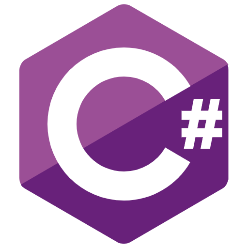

  

    
  
  
   
   
   
   
  

    
  

   
   
   
   
  

    

      <h3>About Me :</h3>
    
 
    

      

         
      Hey ! Welcome ! I'm so happy to see you here !  
         
      I'm Théo a french strudent in carrer change process in Fullstack developper at Ada Tech School in Paris. I'm so happy to share with you my learning's projects. 
      Well, it's not the right place to write a novel so this some point that, I wish, interest you :  
         
      🔭 I'm looking for a apprendticeship in fullstack development. 
      :sound: I speak  French (fluently), English(B2) and japanese(A1) 
      :star: I'm creative, serious and I love to learn new things 
      :family: I like team work too 
      :email: If you want to contact me : <a href="marcilletheo93@gmail.com">marcilletheo93@gmail.com</a> 
      This is my linkedin :<a href="https://www.linkedin.com/in/th%C3%A9o-marcille-866393235/">Théo Marcille</a>
         
         
      My hobbies are : 
      

      <ul> 
        <li>:art: drawing :art:</li>
        <li>:book: reading :book:</li>
        <li>:video_game: playing video games and board games :game_die:</li>
        <li>:pencil: writing :pencil:</li>  
      </ul>     
    

     
     
    

      

        <h3>Stack</h3>
      

       
      

        
        
        
        
        
        
        
        
        
        
        
      

  

